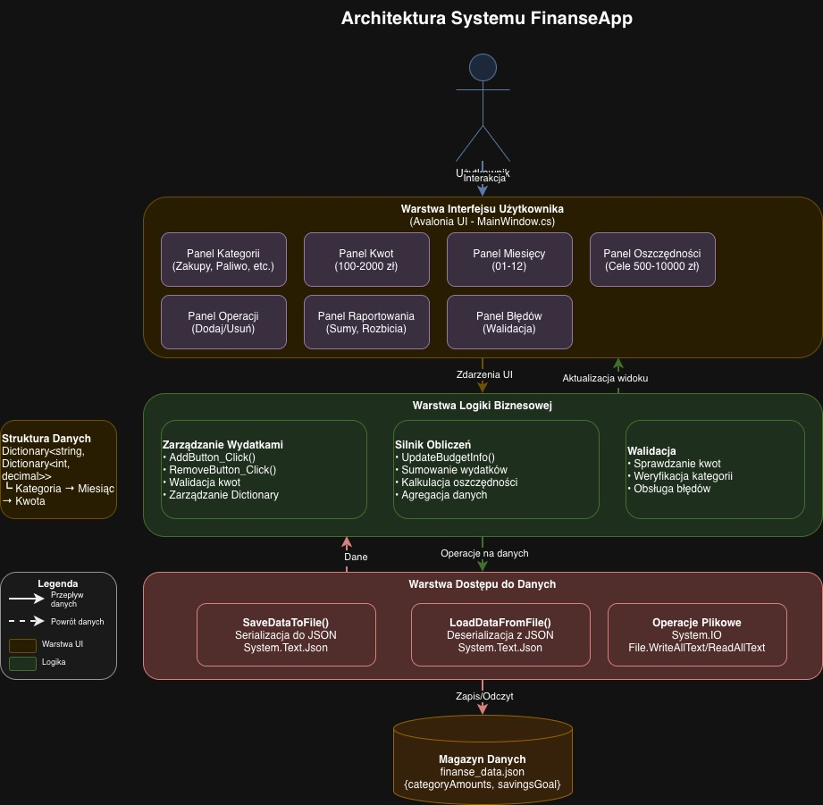

# FinanseApp - Aplikacja do Zarządzania Budżetem Osobistym

## Informacje Ogólne

**FinanseApp** to desktopowa aplikacja finansowa umożliwiająca zarządzanie budżetem osobistym, monitorowanie wydatków w różnych kategoriach oraz śledzenie postępu w osiąganiu celów oszczędnościowych. Aplikacja oferuje intuicyjny interfejs użytkownika z wizualizacją wydatków i możliwością zarządzania danymi finansowymi w układzie miesięcznym.

### Główne Cele Projektu
- Śledzenie wydatków w różnych kategoriach życiowych
- Zarządzanie celami oszczędnościowymi
- Analiza wydatków w ujęciu miesięcznym
- Prosty i przejrzysty interfejs użytkownika

---

## Wymagania Funkcjonalne

### FR-1: Zarządzanie Wydatkami
- Użytkownik może dodawać wydatki w następujących kategoriach: Zakupy, Paliwo, Rozrywka, Oszczędności, Opłaty
- System umożliwia wybór kwoty wydatku w zakresie 100-2000 zł (co 100 zł)
- Użytkownik może przypisać wydatek do konkretnego miesiąca (1-12)
- System pozwala na usuwanie wcześniej dodanych wydatków

### FR-2: Cele Oszczędnościowe
- Użytkownik może ustawić cel oszczędnościowy w zakresie 500-10000 zł
- System oblicza i wyświetla postęp w osiąganiu celu jako wartość i procent
- Oszczędności są śledzone jako osobna kategoria wydatków

### FR-3: Raportowanie i Analiza
- System wyświetla sumę wydatków dla wybranego miesiąca
- Aplikacja pokazuje rozbicie wydatków na poszczególne kategorie w wybranym miesiącu
- Dane są prezentowane w czasie rzeczywistym po każdej modyfikacji

### FR-4: Trwałość Danych
- System zapisuje dane do pliku JSON (`finanse_data.json`)
- Dane są automatycznie ładowane przy uruchomieniu aplikacji
- Każda zmiana jest natychmiast zapisywana do pliku

---

## Wymagania Niefunkcjonalne

### Technologia
- **Framework**: .NET (C#)
- **UI Framework**: Avalonia UI 11.x
- **Format danych**: JSON
- **Target Framework**: .NET 6.0 lub wyższy

### Wydajność
- Czas reakcji interfejsu: < 100ms dla operacji dodawania/usuwania wydatków
- Czas ładowania danych z pliku: < 500ms
- Obsługa do 1000 wpisów wydatków bez degradacji wydajności

### Bezpieczeństwo
- Dane przechowywane lokalnie na urządzeniu użytkownika
- Brak przesyłania danych przez sieć
- Walidacja wprowadzanych kwot (tylko wartości dodatnie)
- Ochrona przed utratą danych przez automatyczne zapisywanie

### Użyteczność
- Intuicyjny interfejs użytkownika z wizualnym feedbackiem (zmiana koloru przycisków)
- Responsywny layout z możliwością przewijania
- Czytelna prezentacja informacji finansowych w formacie walutowym
- Komunikaty o błędach wyświetlane bezpośrednio w interfejsie

### Przenośność
- Aplikacja wieloplatformowa (Windows, macOS, Linux) dzięki Avalonia UI
- Dane przechowywane w standardowym formacie JSON

---

## Funkcjonalności i Moduły Systemu

### Moduł Interfejsu Użytkownika
- **Panel kategorii** - Wybór kategorii wydatku poprzez przyciski
- **Panel szybkich kwot** - Wybór predefiniowanych kwot wydatków (100-2000 zł)
- **Panel miesięcy** - Wybór miesiąca dla wydatku (01-12)
- **Panel celów oszczędnościowych** - Ustawianie docelowej kwoty oszczędności (500-10000 zł)
- **Panel operacji** - Przyciski do dodawania i usuwania wydatków
- **Panel raportowania** - Wyświetlanie sum i rozbić wydatków

### Moduł Zarządzania Danymi
- **Struktura danych** - Słownik kategoria → miesiąc → kwota
- **Serializacja** - Zapis danych do formatu JSON
- **Deserializacja** - Odczyt danych z pliku JSON
- **Walidacja** - Sprawdzanie poprawności operacji

### Moduł Obliczeń
- Sumowanie wydatków dla wybranego miesiąca
- Obliczanie postępu w osiąganiu celu oszczędnościowego
- Agregacja danych z wielu miesięcy (dla oszczędności)

---

## Przypadki Użycia

### UC-1: Dodanie Nowego Wydatku
**Aktor**: Użytkownik  
**Warunki wstępne**: Aplikacja jest uruchomiona  
**Przebieg**:
1. Użytkownik wybiera kategorię wydatku
2. Użytkownik wybiera kwotę z dostępnych opcji
3. Użytkownik wybiera miesiąc
4. Użytkownik klika przycisk "Dodaj wybraną kwotę"
5. System dodaje wydatek do wybranej kategorii i miesiąca
6. System aktualizuje wyświetlane sumy
7. System zapisuje dane do pliku

**Alternatywny przebieg**:
- 4a. Użytkownik nie wybrał kwoty → System wyświetla komunikat błędu

### UC-2: Usunięcie Wydatku
**Aktor**: Użytkownik  
**Warunki wstępne**: Istnieją wcześniej dodane wydatki  
**Przebieg**:
1. Użytkownik wybiera kategorię
2. Użytkownik wybiera kwotę do usunięcia
3. Użytkownik wybiera miesiąc
4. Użytkownik klika przycisk "Usuń wybraną kwotę"
5. System zmniejsza kwotę w danej kategorii i miesiącu
6. System aktualizuje wyświetlane sumy
7. System zapisuje dane do pliku

**Alternatywny przebieg**:
- 4a. Wybrana kwota nie istnieje w danej kategorii/miesiącu → System wyświetla komunikat błędu

### UC-3: Ustawienie Celu Oszczędnościowego
**Aktor**: Użytkownik  
**Warunki wstępne**: Aplikacja jest uruchomiona  
**Przebieg**:
1. Użytkownik wybiera docelową kwotę oszczędności
2. System zapisuje nowy cel
3. System przelicza i wyświetla aktualny postęp
4. System zapisuje zmianę do pliku

### UC-4: Przeglądanie Wydatków
**Aktor**: Użytkownik  
**Warunki wstępne**: Istnieją zapisane dane  
**Przebieg**:
1. Użytkownik wybiera miesiąc
2. System wyświetla sumę wydatków dla wybranego miesiąca
3. System wyświetla rozbicie na kategorie
4. System pokazuje postęp w osiąganiu celu oszczędnościowego

---

## Architektura Systemu



*Rysunek: Warstwowa architektura aplikacji FinanseApp z zaznaczeniem głównych komponentów i przepływu danych*

### Wzorce Projektowe
- **Monolithic Architecture** - Cała logika w jednej klasie MainWindow
- **Event-Driven** - Obsługa zdarzeń UI (kliknięcia przycisków)
- **Dictionary-based Storage** - Hierarchiczna struktura danych (kategoria → miesiąc → kwota)

---

## Stos Technologiczny

### Frontend
- **Avalonia UI 11.x** - Cross-platform UI framework
  - AXAML - deklaratywny język znaczników UI
  - Controls: Window, Button, TextBox, TextBlock, StackPanel, WrapPanel, ScrollViewer

### Backend
- **C# .NET** - Główny język programowania
- **System.Text.Json** - Serializacja/deserializacja JSON
- **System.IO** - Operacje na plikach

### Biblioteki i Pakiety NuGet
```xml
- Avalonia (11.x)
- Avalonia.Desktop
- Avalonia.Themes.Fluent
```

### Narzędzia Deweloperskie
- **.NET SDK 6.0+**
- **Visual Studio 2022** / **JetBrains Rider** / **VS Code**
- **Git** - Kontrola wersji

---

## Proces Uruchomienia Projektu

### Wymagania Systemowe
- .NET SDK 6.0 lub wyższy
- System operacyjny: Windows 10/11, macOS 10.15+, lub Linux (dowolna nowoczesna dystrybucja)
- 100 MB wolnego miejsca na dysku

### Instalacja .NET SDK

**Windows:**
```bash
# Pobierz z https://dotnet.microsoft.com/download
# Lub użyj winget:
winget install Microsoft.DotNet.SDK.6
```

**macOS:**
```bash
brew install --cask dotnet-sdk
```

**Linux:**
```bash
# Debian/Ubuntu
wget https://packages.microsoft.com/config/ubuntu/20.04/packages-microsoft-prod.deb -O packages-microsoft-prod.deb
sudo dpkg -i packages-microsoft-prod.deb
sudo apt-get update
sudo apt-get install -y dotnet-sdk-6.0
```

### Uruchomienie Aplikacji

1. **Klonowanie repozytorium:**
```bash
git clone https://github.com/404PaulinaNotFound/P_IV.git
cd test/FinanseApp
```

2. **Przywrócenie zależności:**
```bash
dotnet restore
```

3. **Kompilacja projektu:**
```bash
dotnet build
```

4. **Uruchomienie aplikacji:**
```bash
dotnet run
```

### Alternatywnie - Kompilacja do pliku wykonywalnego:
```bash
# Windows
dotnet publish -c Release -r win-x64 --self-contained

# macOS
dotnet publish -c Release -r osx-x64 --self-contained

# Linux
dotnet publish -c Release -r linux-x64 --self-contained
```

Pliki wykonywalne znajdą się w katalogu `bin/Release/net6.0/[runtime]/publish/`

---

## Struktura Folderów

```
test/
│
├── P_IV.sln                          # Solution file dla Visual Studio
│
├── docs/                             # Dokumentacja projektu
│   ├── architecture.jpg              # Diagram architektury systemu
│   └── architecture.drawio           # Źródłowy plik diagramu (draw.io)
│
└── FinanseApp/                       # Główny projekt aplikacji
    │
    ├── App.axaml                     # Definicja głównej aplikacji (AXAML)
    ├── App.axaml.cs                  # Code-behind dla App.axaml
    │
    ├── MainWindow.axaml              # Definicja głównego okna (AXAML)
    ├── MainWindow.axaml.cs           # Code-behind dla MainWindow
    ├── MainWindow.cs                 # Główna logika aplikacji (UI + Business Logic)
    │
    ├── Program.cs                    # Entry point aplikacji
    ├── AvaloniaApp.csproj            # Plik projektu (konfiguracja, zależności)
    ├── app.manifest                  # Manifest aplikacji Windows
    │
    ├── finanse_data.json             # Plik z danymi użytkownika (generowany)
    │
    ├── bin/                          # Skompilowane pliki binarne (ignorowane w git)
    │   ├── Debug/
    │   └── Release/
    │
    └── obj/                          # Pliki tymczasowe kompilacji (ignorowane w git)
        └── ...
```

### Opis Kluczowych Plików

| Plik | Opis |
|------|------|
| `MainWindow.cs` | Główny plik zawierający całą logikę UI i zarządzania danymi |
| `App.axaml` | Definiuje globalny wygląd aplikacji i zasoby |
| `Program.cs` | Entry point - inicjalizuje Avalonia i uruchamia aplikację |
| `AvaloniaApp.csproj` | Konfiguracja projektu, pakiety NuGet, target framework |
| `finanse_data.json` | Plik z danymi finansowymi użytkownika (persystencja) |
| `docs/architecture.jpg` | Wizualny diagram architektury systemu |

### Konwencje Nazewnictwa
- **Klasy**: PascalCase (np. `MainWindow`)
- **Metody prywatne**: PascalCase z prefiksem (np. `CreateMainPanel`)
- **Pola prywatne**: camelCase z podkreśleniem (np. `_addButton`)
- **Pliki AXAML**: PascalCase z rozszerzeniem `.axaml`

---

## Rozszerzanie Funkcjonalności

### Dodanie Nowej Kategorii
Edytuj plik `MainWindow.cs`, znajdź linię:
```csharp
var categories = new List<string> { "Zakupy", "Paliwo", "Rozrywka", "Oszczędności", "Opłaty" };
```
Dodaj nową kategorię do listy.

### Zmiana Zakresu Kwot
Edytuj pętlę w metodzie `CreateMainPanel()`:
```csharp
for (int i = 100; i <= 2000; i += 100)  // Zmień zakres i krok
```

### Dodanie Nowej Waluty
System obecnie używa formatu walutowego domyślnego dla kultury systemowej. Aby zmienić walutę, użyj:
```csharp
// Zamiast {totalSpent:C}
string.Format(new System.Globalization.CultureInfo("en-US"), "{0:C}", totalSpent)
```

---

## Licencja

Projekt stworzony na potrzeby edukacyjne i osobiste.

---

## Autor

**Paulina**  
GitHub: [@404PaulinaNotFound](https://github.com/404PaulinaNotFound)

---

## Kontakt i Wsparcie

W razie pytań lub problemów, utwórz Issue w repozytorium GitHub.
